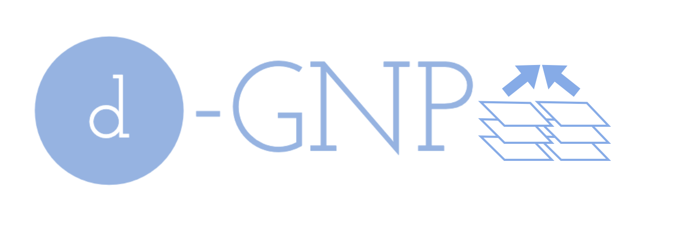
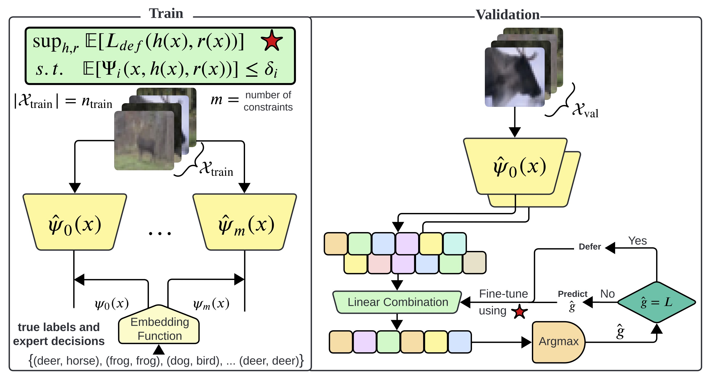

<p align="center">

</p>

This repository contains the experiments of the paper "[A Unifying Post-Processing Framework for Multi-Objective Learn-to-Defer Problems](https://arxiv.org/abs/2407.12710)" that was [published](https://neurips.cc/virtual/2024/poster/95484) in NeurIPS 2024. This paper introduces a post-processing method for solving a variety of multi-objective learning problems, including but not limited to learn-to-defer problem and fair multi-class classification problem. During this method, first an embedding function related to each objective is trained, and then an optimal classifier via linear combination of the embedding functions is obtained using validation data. This method presents an alternative paradigm compared to Lagrangian-based methods such as primal-dual methods.

The experiments are conducted using the ACSIncome and COMPAS datasets. The code for the experiments can be found in the following Jupyter Notebook files:


- ACS.ipynb
- COMPAS.ipynb

Please refer to these notebooks for the detailed implementation and analysis of the plots.

## Dataset
The following datasets are used for the experiments:

- The ACSIncome dataset from [Folktables](https://github.com/socialfoundations/folktables) package for income prediction
- The [COMPAS](https://www.science.org/doi/10.1126/sciadv.aao5580) dataset for prediction of recidivism
## Requirements

To run the code in the Jupyter Notebook files, make sure you have the dependencies installed. To do this, you can run the following command in your terminal:

```sh
pip install -r requirements.txt
```

## Usage


1. Clone this repository to your local machine.
2. Open the Jupyter Notebook files (ACS.ipynb and COMPAS.ipynb) using Jupyter Notebook.
3. Run the code cells in the notebooks to reproduce the experiments and generate the plots.

## License

This project is licensed under the [MIT License](LICENSE).

## Citation

In case that you have used codes in this repository, please consider citing our paper:

```bibtex
@article{charusaie2024unifying,
  title={A Unifying Post-Processing Framework for Multi-Objective Learn-to-Defer Problems},
  author={Charusaie, Mohammad-Amin and Samadi, Samira},
  journal={arXiv preprint arXiv:2407.12710},
  year={2024}
}
```